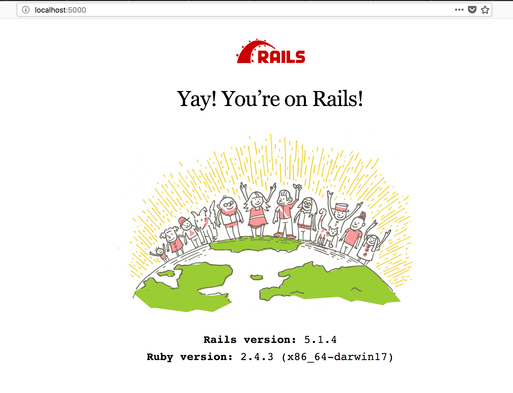

# README

## Rails install notes

```
 $ rvm list
 $ rvm use 2.4.3
 $ rvm gemset list
 $ rvm gemset create a-testing
 $ rvm gemset use a-testing
 $ gem list
 $ gem install rails
 $ rails new a --database=postgresql
 $ cd a
 $ cat Gemfile
 $ rvm --default use 2.4.3
 $ rvm gemset list_all
 $ gem list
 $ rvm use 2.4.3@a-testing --create --ruby-version 
 $ rvm gemset name
 $ cat .ruby-gemset .ruby-version
 $ bundle install
```

## Git work .. after creating new repo in github
```
 $ git status
 $ vi README.md
 $ git add -A
 $ git commit -a -m "initial commit afer rails new app --database=postgresql and rvm work"
 $ git commit --amend
 $ git remote add origin https://github.com/tobybot11/devise-testing.git
 $ git push -u origin master
```

## Bootstrap
### helpful-link: https://github.com/twbs/bootstrap-rubygem
```
 $ vi Gemfile
# toby adds
gem 'bootstrap', '~> 4.0.0'
 $ bundle install
 $ vi app/assets/stylesheets/application.css
@import "bootstrap";
 $ mv app/assets/stylesheets/application.css app/assets/stylesheets/application.scss
 $ rails version
5.1.4
 $ vi Gemfile
gem 'jquery-rails'
 $ bundle install
 $ vi conf/application.js
require 'jquery3'
require 'popper'
require 'bootstrap-sprockets'
```

## gpg yak shaving interlude
```
 $ gpg --edit-keys toby.ford@pobox.com
 > passwd
 > save
```

## fix tzinfo warning

```
 $ vi Gemfile
# Windows does not include zoneinfo files, so bundle the tzinfo-data gem
# gem 'tzinfo-data', platforms: [:mingw, :mswin, :x64_mingw, :jruby]
gem 'tzinfo-data'
 $ bundle install
 PANIC!
 $ vi Gemfile
>>> Remove tzinfo-data line <<<
```

## rvm yak shaving interlude
```
 $ rvm-prompt
```

## this didn't work BTW
```
 ∴ rails generate layout:install bootstrap4
```

## Added Foreman
```
 ∴ vi Gemfile
gem 'foreman'
 ∴ bundle install
 ∴ cat Procfile
rails: bundle exec rails 
 ∴ foreman start
```


## get a basic rails app in place usign [RoR Getting Start Guide](http://guides.rubyonrails.org/getting_started.html)
### helpful linke on [PG Setup](https://blog.willj.net/2011/05/31/setting-up-postgresql-for-ruby-on-rails-development-on-os-x/)
```
 ∴ bin/rails generate controller Welcome index
 ∴ vi app/views/welcome/index.html.erb
 <h2>Hello universe!</h2>
 ∴ rails routes
                  Prefix Verb URI Pattern   Controller#Action
welcome_index GET  /welcome/index(.:format) welcome#index
<<< Problems with loading //=bootstrap-sprockets >>>
 ∴ vi Gemfile .. i think it was the bootstrap-sass line that fixed it
 ∴ vi config/routes.rb
resources :articles
 ∴ rails routes
 ∴ rails generate controller Articles
 ∴ bin/rails generate model Article title:string text:text
 ∴ pg_ctl -D /usr/local/var/postgres stop -s -m fast
 ∴ pg_ctl -D /usr/local/var/postgres -l /usr/local/var/postgres/server.log start
 ∴ vi config/database.yml <- into development section
username: a
password: new2a
 ∴ createuser a
 ∴ createdb -Oa -Eutf8 a_development
 ∴ createdb -Oa -Eutf8 a_test
 ∴ psql -U a a_development
a_development=> ALTER USER "a" WITH PASSWORD 'new2a';
 ∴ rails db:migrate

```


## TODO
Things you may want to cover:

* Ruby version , System dependencies , Configuration , Database creation , Database initialization
* How to run the test suite, Services (job queues, cache servers, search engines, etc.)
* Deployment instructions
